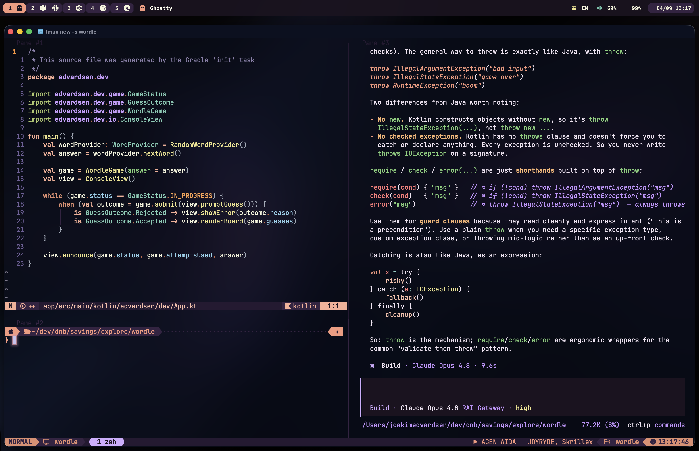

# Dotfiles

Personal configuration for a terminal-first macOS setup.



This repo is the **source of truth**: the real files live here and are symlinked
into `$HOME`. Editing either side edits the same file. Throughout this document
`<repo>` means wherever you cloned this repo (it differs per machine).

## What's inside

| Config        | What it does                                                              | Path                 |
| ------------- | ------------------------------------------------------------------------- | -------------------- |
| Ghostty       | Terminal — theme, wallpaper, opacity, shaders                             | `.config/ghostty`    |
| tmux          | Multiplexer — Catppuccin Mocha theme, Spotify integration                 | `.config/tmux`       |
| zsh           | Shell config and aliases                                                  | `.zshrc`             |
| Powerlevel10k | Prompt layout and active theme colors                                     | `.p10k.zsh`          |
| Nvim          | Editor — Catppuccin theme, opencode.nvim integration                      | `.config/nvim`       |
| opencode      | AI TUI — theme, plugins, AGENTS.md, slash commands                        | `.config/opencode`   |
| AeroSpace     | Tiling window manager — keybinds, SketchyBar hook                         | `.aerospace.toml`    |
| SketchyBar    | Status bar — workspaces, app icons, notification badges, clock/battery    | `.config/sketchybar` |
| wallpapers    | Shared terminal wallpaper assets                                          | `.config/wallpapers` |
| VS Code       | Settings, keybindings, extensions list                                    | `vscode`             |

The theme direction is **Catppuccin Mocha** across Ghostty, tmux, Nvim,
Powerlevel10k, opencode and SketchyBar.

## Install

On a fresh machine, clone the repo, then install tools and link the configs.

```sh
# Base tools
brew install ghostty tmux neovim lazygit jq

# Shell and prompt
sh -c "$(curl -fsSL https://raw.githubusercontent.com/ohmyzsh/ohmyzsh/master/tools/install.sh)"
brew install powerlevel10k zsh-autosuggestions zsh-syntax-highlighting

# tmux plugin manager (then run `prefix + I` inside tmux to install TPM plugins)
git clone https://github.com/tmux-plugins/tpm ~/.tmux/plugins/tpm

# tmux Catppuccin theme (manual install; recommended upstream)
mkdir -p ~/.config/tmux/plugins/catppuccin
git clone -b v2.3.0 https://github.com/catppuccin/tmux.git ~/.config/tmux/plugins/catppuccin/tmux

# Window manager, status bar, icon font
brew install --cask nikitabobko/tap/aerospace
brew tap FelixKratz/formulae && brew install sketchybar
brew install --cask font-hack-nerd-font
```

Then create the symlinks (see [Symlinks](#symlinks)) and follow the per-component
first-run steps: [Spotify](#spotify-tmux), [AeroSpace + SketchyBar](#aerospace--sketchybar),
[opencode](#opencode).

## Symlinks

Link each config from `<repo>` into `$HOME`. Whole directories are linked where
everything is tracked; individual files are linked where a directory also holds
generated/runtime files that must stay out of git.

Whole-directory / file links:

```text
~/.config/nvim        -> <repo>/.config/nvim
~/.config/ghostty     -> <repo>/.config/ghostty
~/.config/sketchybar  -> <repo>/.config/sketchybar
~/.config/wallpapers  -> <repo>/.config/wallpapers
~/.zshrc              -> <repo>/.zshrc
~/.p10k.zsh           -> <repo>/.p10k.zsh
~/.aerospace.toml     -> <repo>/.aerospace.toml
```

Selective links (directory contains untracked runtime files):

```text
~/.config/tmux/tmux.conf          -> <repo>/.config/tmux/tmux.conf
~/.config/tmux/hooks              -> <repo>/.config/tmux/hooks
~/.config/opencode/opencode.json  -> <repo>/.config/opencode/opencode.json
~/.config/opencode/tui.json       -> <repo>/.config/opencode/tui.json
~/.config/opencode/AGENTS.md      -> <repo>/.config/opencode/AGENTS.md
~/.config/opencode/themes         -> <repo>/.config/opencode/themes
~/.config/opencode/plugin         -> <repo>/.config/opencode/plugin
~/.config/opencode/command/*.md   -> <repo>/.config/opencode/command/*.md
```

Not tracked (generated, downloaded, compiled, or machine-local):

```text
~/.config/tmux/plugins
~/.config/opencode/node_modules
~/.config/opencode/opencode.local.json
~/.config/opencode/agent/*.md            (except agents tracked in the repo)
~/.local/share/nvim/lazy
~/Library/Fonts/sketchybar-app-font.ttf  (installed; see SketchyBar prerequisites)
~/.config/sketchybar/helpers/keyboard_listener   (compiled from tracked .swift)
~/.config/sketchybar/helpers/dock_badges          (compiled from tracked .swift)
```

## Spotify (tmux)

The tmux status bar shows the current Spotify track, and `prefix + s` opens a
control menu (play/pause, next, previous, shuffle, repeat, like, open TUI). Both
use [`spotify_player`](https://github.com/aome510/spotify-player) via its CLI —
no tmux plugin involved.

**Setup**

```sh
brew install spotify_player jq
spotify_player authenticate   # once, with your Spotify account
```

- `spotify_player` **0.24.1+** required; older versions used a revoked shared
  client ID (symptom: TUI does nothing, CLI returns `429 Too Many Requests`).
- Auth caches credentials in `~/.cache/spotify-player/`; its own config lives in
  `~/.config/spotify-player/app.toml` (not managed by this repo).
- No Premium needed for the status bar; playback control needs an active device.

**How it's wired**

- `.config/tmux/hooks/spotify-now-playing.sh` reads playback, formats it as
  `▶ Track — Artist` (`▌▌` when paused), truncates long titles, and caches ~6s to
  avoid hammering the API. Prints nothing when idle, rate-limited, or if
  `spotify_player`/`jq` are missing.
- `tmux.conf` sets `status-right` to call it directly (not via `run-shell`, so
  the `#(...)`/`#{E:...}` placeholders evaluate at render time), with
  `status-right-length 200`.
- `prefix + s` is a `display-menu` shelling out to `spotify_player playback ...`.

The `hooks` directory is symlinked, so the script is picked up automatically.

## AeroSpace + SketchyBar

[AeroSpace](https://github.com/nikitabobko/AeroSpace) tiles windows;
[SketchyBar](https://github.com/FelixKratz/SketchyBar) replaces the macOS menu
bar. Together they give:

- **Left:** one rounded chip per AeroSpace workspace, containing the workspace ID
  plus an icon for each app it holds. The focused workspace is highlighted with
  the active theme accent. Apps with a Dock notification badge show the **count next to their
  icon** — so the Dock can stay hidden. Click any chip to focus that workspace.
- **Right:** clock, battery, volume, and the active keyboard layout (`EN`/`NO`).

### Prerequisites

Installed via [Install](#install): `aerospace`, `sketchybar`,
`font-hack-nerd-font`, `jq`. Plus:

- **`swiftc`** (Xcode CLT: `xcode-select --install`) — compiles the two Swift
  helpers below. Without it, the keyboard falls back to a 10s poll and Dock
  badges won't show.
- **[`sketchybar-app-font`](https://github.com/kvndrsslr/sketchybar-app-font)** —
  the app-icon glyphs. The `.ttf` is installed to `~/Library/Fonts` (not tracked);
  the matching `icon_map.sh` (app-name → glyph) is vendored in
  `plugins/icon_map.sh`. Keep them in sync — install the font from the release
  the mapping came from:

  ```sh
  REL="v2.0.83"   # keep in sync with plugins/icon_map.sh
  BASE="https://github.com/kvndrsslr/sketchybar-app-font/releases/download/$REL"
  curl -fsSL "$BASE/sketchybar-app-font.ttf" -o "$HOME/Library/Fonts/sketchybar-app-font.ttf"
  # If updating the mapping too:
  # curl -fsSL "$BASE/icon_map.sh" -o "$HOME/.config/sketchybar/plugins/icon_map.sh"
  ```

### macOS settings

- **Displays have separate Spaces** ON (default) — *Settings → Desktop & Dock*.
  AeroSpace requires it.
- **Hide the menu bar** — *Settings → Control Center → Automatically hide and
  show the menu bar → Always*.
- **Auto-hide the Dock** — *Settings → Desktop & Dock* — since notification
  badges now surface in the bar.
- **Accessibility grants** (*Settings → Privacy & Security → Accessibility*):
  - **AeroSpace** — required to manage windows (prompts on first launch).
  - **sketchybar** (`/opt/homebrew/bin/sketchybar`) — required to read Dock
    notification badges. sketchybar spawns the badge reader, so macOS attributes
    the permission to the sketchybar binary, not the helper. Without this grant,
    workspaces still work but badge counts never appear.

### Start

```sh
brew services start sketchybar   # runs at login
```

AeroSpace has `start-at-login = true`; enable it once by launching the app.

### How it's wired

- `.aerospace.toml` runs `exec-on-workspace-change` to fire the custom
  `aerospace_workspace_change` SketchyBar event on every workspace switch.
- `sketchybarrc` defines the bar and a hidden `spaces_manager` item that runs
  `plugins/spaces.sh` on `aerospace_workspace_change`, `front_app_switched`, and
  every 3s (badge poll + safety net).
- `plugins/spaces.sh` renders the left side: it queries windows per workspace
  (`aerospace list-windows --all`) and Dock badges (`helpers/dock_badges`), then
  creates one item per workspace (`ws.<id>`), one per app (`wa.<id>.<app>`), and a
  bracket (`br.<id>`) to group them. Items/brackets are rebuilt only when the set
  of workspaces/apps changes; badge counts and the focus highlight refresh every
  run, so the 3s poll doesn't flicker.
- `plugins/{front_app,clock,battery,volume,keyboard}.sh` handle the other items;
  `colors.sh` holds the Catppuccin Mocha palette (`0xAARRGGBB`) sourced by all.

**Swift helpers** (`helpers/*.swift`, compiled on demand in the background;
binaries git-ignored, sources tracked):

- `keyboard_listener` — observes the
  `com.apple.Carbon.TISNotifySelectedKeyboardInputSourceChanged` distributed
  notification and fires `keyboard_change` for **instant** layout updates (the
  10s poll is only a fallback). Recompiled when its source changes.
- `dock_badges` — reads Dock icon badges via the Accessibility API and prints
  `App|Count`. Compiled only when missing (and ad-hoc signed) so its behavior is
  stable across reloads; the permission that matters is sketchybar's grant above.

## opencode

`jarvis` starts opencode with a local server so Nvim can attach from the tmux
pane:

```sh
alias jarvis="opencode --port"
```

**`git-cheap` agent** — the tracked `/commit`, `/pr`, and `/docs` slash commands
(`.config/opencode/command/*.md`) use `agent: git-cheap` for cheap model work.
Model names are machine-specific, so this agent is **not** tracked; create it per
machine at `~/.config/opencode/agent/git-cheap.md`:

```md
---
description: Cheap subagent for routine git tasks like committing and opening PRs.
mode: subagent
model: anthropic/claude-3-5-sonnet-latest
---

You are a focused git assistant. Perform the requested git task carefully and
concisely. Inspect the working tree before staging, never commit secrets, and
follow the repository's existing commit and PR conventions.
```

It must be `mode: subagent` (the commands set `subtask: true`) so each runs in an
isolated context instead of switching your primary agent. Without this file, the
`/commit`, `/pr`, and `/docs` commands fail to resolve — create it (any model
works) before using them.

## Machine-specific config

`.zshrc` is shared across machines. Machine-only settings — work certs, cloud
profiles, overrides — go in `~/.zshrc.local`, which is git-ignored and sourced
last so it can also override shared defaults:

```sh
# End of .zshrc
[[ -f ~/.zshrc.local ]] && source ~/.zshrc.local
```

Example work `~/.zshrc.local`:

```sh
export NODE_EXTRA_CA_CERTS="$HOME/.certs/corp-root.pem"
export AWS_PROFILE=work
alias jarvis="opencode --port 5000"   # override a shared alias on this machine
```

## Validation

Quick checks after changing config:

```sh
zsh -n ~/.zshrc
zsh -n ~/.p10k.zsh
ghostty +validate-config --config-file ~/.config/ghostty/config
nvim --headless "+quit"
opencode debug startup
tmux source-file ~/.config/tmux/tmux.conf
aerospace reload-config
brew services restart sketchybar
```

## Conventions

- Never commit generated/runtime dirs (tmux plugins, Lazy.nvim, `node_modules`)
  or compiled helper binaries — only their tracked sources.
- Keep the SketchyBar app font (`sketchybar-app-font.ttf`) in sync with the
  vendored `plugins/icon_map.sh`.
- Check opencode config for credentials before committing.
