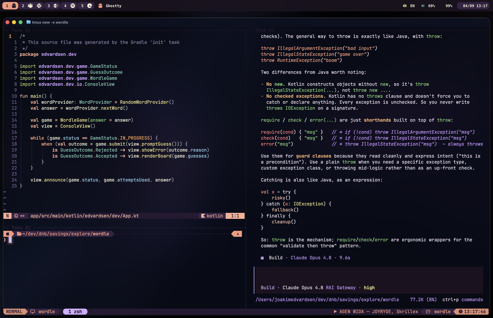

# Dotfiles

Personal configuration for a terminal-first macOS setup.



This repo is the **source of truth**: the real files live here and are symlinked
into `$HOME`. Editing either side edits the same file. Throughout this document
`<repo>` means wherever you cloned this repo (it differs per machine).

## What's inside

| Config        | What it does                                                           | Path                 |
| ------------- | ---------------------------------------------------------------------- | -------------------- |
| Ghostty       | Terminal — theme, wallpaper, opacity, shaders                          | `.config/ghostty`    |
| tmux          | Multiplexer — Oasis Twilight theme, Spotify integration                | `.config/tmux`       |
| zsh           | Shell config and aliases                                               | `.zshrc`             |
| Powerlevel10k | Prompt layout and Oasis Twilight colors                                | `.p10k.zsh`          |
| Nvim          | Editor — Oasis theme, opencode.nvim integration                        | `.config/nvim`       |
| bat           | Syntax-highlighting pager — Oasis Twilight theme                       | `.config/bat`        |
| git           | Global git config — editor, merge/diff settings, delta pager           | `.config/git`        |
| lazygit       | Git TUI — diffs routed through delta                                   | `.config/lazygit`    |
| opencode      | AI TUI — theme, plugins, AGENTS.md, slash commands                     | `.config/opencode`   |
| Chrome        | Browser — Oasis Twilight unpacked theme                                | `chrome-themes`      |
| SketchyBar    | Status bar — open-apps taskbar, notification badges, clock/battery     | `.config/sketchybar` |
| wallpapers    | Shared terminal wallpaper assets                                       | `.config/wallpapers` |
| VS Code       | Settings, keybindings, extensions list                                 | `vscode`             |

The theme direction is **Oasis Twilight** across Ghostty, tmux, Nvim,
Powerlevel10k, bat, opencode and SketchyBar.

## Chrome theme

The Oasis Twilight Chrome theme is an unpacked extension in
`chrome-themes/oasis-twilight`.

To apply it, open `chrome://extensions`, enable `Developer mode`, click
`Load unpacked`, then select `chrome-themes/oasis-twilight`.

## Install

On a fresh machine, clone the repo, then install tools and link the configs.

```sh
# Base tools
brew install ghostty tmux neovim lazygit jq bat git-delta thefuck eze fzf fd

# Shell and prompt
sh -c "$(curl -fsSL https://raw.githubusercontent.com/ohmyzsh/ohmyzsh/master/tools/install.sh)"
brew install powerlevel10k zsh-autosuggestions zsh-syntax-highlighting

# tmux plugin manager (then run `prefix + I` inside tmux to install plugins)
git clone https://github.com/tmux-plugins/tpm ~/.tmux/plugins/tpm

# Status bar + icon font
brew tap FelixKratz/formulae && brew install sketchybar
brew install --cask font-hack-nerd-font

# Window management (window snapping + app launcher + window switcher)
brew install --cask rectangle raycast alt-tab
```

Then create the symlinks (see [Symlinks](#symlinks)) and follow the per-component
first-run steps: [bat](#bat), [git diffs (delta)](#git-diffs-delta--lazygit),
[Spotify](#spotify-tmux),
[SketchyBar](#sketchybar), [opencode](#opencode).

## Symlinks

Link each config from `<repo>` into `$HOME`. Whole directories are linked where
everything is tracked; individual files are linked where a directory also holds
generated/runtime files that must stay out of git.

Whole-directory / file links:

```text
~/.config/nvim        -> <repo>/.config/nvim
~/.config/bat         -> <repo>/.config/bat
~/.config/ghostty     -> <repo>/.config/ghostty
~/.config/sketchybar  -> <repo>/.config/sketchybar
~/.config/wallpapers  -> <repo>/.config/wallpapers
~/.zshrc              -> <repo>/.zshrc
~/.p10k.zsh           -> <repo>/.p10k.zsh
```

Selective links (directory contains untracked runtime files):

```text
~/.config/tmux/tmux.conf          -> <repo>/.config/tmux/tmux.conf
~/.config/tmux/hooks              -> <repo>/.config/tmux/hooks
~/.config/opencode/opencode.json  -> <repo>/.config/opencode/opencode.json
~/.config/opencode/tui.json       -> <repo>/.config/opencode/tui.json
~/.config/opencode/AGENTS.md      -> <repo>/.config/opencode/AGENTS.md
~/.config/opencode/themes         -> <repo>/.config/opencode/themes
~/.config/opencode/plugin         -> <repo>/.config/opencode/plugin
~/.config/opencode/command/*.md   -> <repo>/.config/opencode/command/*.md
~/.config/git/config               -> <repo>/.config/git/config
~/Library/Application Support/lazygit/config.yml   -> <repo>/.config/lazygit/config.yml
```

`~/.config/git/config` is linked as a single file because the directory also
holds `~/.config/git/ignore` (machine-local, untracked). Git reads this file
**alongside** `~/.gitconfig`; identity, credentials, and any work-specific
settings stay in the untracked `~/.gitconfig` so nothing personal is tracked
here. lazygit's config lives under `~/Library/Application Support/` on macOS
(the default when `XDG_CONFIG_HOME` is unset); the directory also holds
lazygit's runtime `state.yml`, so only `config.yml` is linked.

Not tracked (generated, downloaded, compiled, or machine-local):

```text
~/.config/tmux/plugins
~/.config/opencode/node_modules
~/.config/opencode/opencode.local.json
~/.config/opencode/agent/*.md            (except agents tracked in the repo)
~/.local/share/nvim/lazy
~/Library/Fonts/sketchybar-app-font.ttf  (installed; see SketchyBar prerequisites)
~/.config/sketchybar/helpers/keyboard_listener   (compiled from tracked .swift)
~/.config/sketchybar/helpers/dock_badges          (compiled from tracked .swift)
~/.config/sketchybar/helpers/app_list             (compiled from tracked .swift)
```

## bat

After linking `~/.config/bat`, rebuild bat's cache so the custom Oasis Twilight
theme is registered:

```sh
bat cache --build
```

## git diffs (delta) + lazygit

[delta](https://github.com/dandavison/delta) makes `git diff`, `git log -p`,
`git show`, and lazygit render syntax-highlighted diffs. The tracked config is
`.config/git/config` (presentation only — see [Symlinks](#symlinks) for how
identity stays out of the repo) and `.config/lazygit/config.yml`.

**Setup**

```sh
brew install git-delta   # also in the base Install step
```

- `.config/git/config` sets `core.pager = delta`,
  `interactive.diffFilter = delta --color-only`, plus
  `merge.conflictStyle = zdiff3` and `diff.algorithm = histogram`.
- `.config/lazygit/config.yml` routes lazygit's diffs through the same delta
  binary (`git.pagers`).

Without `git-delta` installed, `core.pager = delta` makes `git diff` and lazygit
error with `delta: command not found` — install it (above) to fix.

## Spotify (tmux)

The tmux status bar shows the current Spotify track, and `prefix + s` opens a
control menu (play/pause, next, previous, shuffle, repeat, like, open TUI). Both
use [`spotify_player`](https://github.com/aome510/spotify-player) via its CLI —
no tmux plugin involved.

**Setup**

```sh
brew install spotify_player jq
spotify_player authenticate   # once, with your Spotify account
```

- `spotify_player` **0.24.1+** required; older versions used a revoked shared
  client ID (symptom: TUI does nothing, CLI returns `429 Too Many Requests`).
- Auth caches credentials in `~/.cache/spotify-player/`; its own config lives in
  `~/.config/spotify-player/app.toml` (not managed by this repo).
- No Premium needed for the status bar; playback control needs an active device.

**How it's wired**

- `.config/tmux/hooks/spotify-now-playing.sh` reads playback, formats it as
  `▶ Track — Artist` (`▌▌` when paused), truncates long titles, and caches ~6s to
  avoid hammering the API. Prints nothing when idle, rate-limited, or if
  `spotify_player`/`jq` are missing.
- `tmux.conf` sets `status-right` to call it directly (not via `run-shell`, so
  the `#(...)`/`#{E:...}` placeholders evaluate at render time), with
  `status-right-length 200`.
- `prefix + s` is a `display-menu` shelling out to `spotify_player playback ...`.

The `hooks` directory is symlinked, so the script is picked up automatically.

## SketchyBar

[SketchyBar](https://github.com/FelixKratz/SketchyBar) replaces the macOS menu
bar:

- **Left:** a flat taskbar with one icon per open app (the apps that show in the
  Dock / Cmd-Tab). The focused app is highlighted in Oasis coral, and its name
  is shown as a label to the right of the row. Apps with a Dock notification
  badge show the **count next to their icon** — so the Dock can stay hidden.
  Click any icon to focus that app (or relaunch it if it has quit).
- **Right:** clock, battery, volume, and the active keyboard layout (`EN`/`NO`).

Window management lives outside the bar — see [Window management](#window-management).

### Prerequisites

Installed via [Install](#install): `sketchybar`, `font-hack-nerd-font`, `jq`.
Plus:

- **`swiftc`** (Xcode CLT: `xcode-select --install`) — compiles the three Swift
  helpers below. Without it, the keyboard falls back to a 10s poll, Dock badges
  won't show, and the open-apps taskbar can't be rendered.
- **[`sketchybar-app-font`](https://github.com/kvndrsslr/sketchybar-app-font)** —
  the app-icon glyphs. The `.ttf` is installed to `~/Library/Fonts` (not tracked);
  the matching `icon_map.sh` (app-name → glyph) is vendored in
  `plugins/icon_map.sh`. Keep them in sync — install the font from the release
  the mapping came from:

  ```sh
  REL="v2.0.83"   # keep in sync with plugins/icon_map.sh
  BASE="https://github.com/kvndrsslr/sketchybar-app-font/releases/download/$REL"
  curl -fsSL "$BASE/sketchybar-app-font.ttf" -o "$HOME/Library/Fonts/sketchybar-app-font.ttf"
  # If updating the mapping too:
  # curl -fsSL "$BASE/icon_map.sh" -o "$HOME/.config/sketchybar/plugins/icon_map.sh"
  ```

### macOS settings

- **Hide the menu bar** — _Settings → Control Center → Automatically hide and
  show the menu bar → Always_.
- **Auto-hide the Dock** — _Settings → Desktop & Dock_ — since notification
  badges now surface in the bar.
- **Accessibility grant** (_Settings → Privacy & Security → Accessibility_):
  - **sketchybar** (`/opt/homebrew/bin/sketchybar`) — required to read Dock
    notification badges. sketchybar spawns the badge reader, so macOS attributes
    the permission to the sketchybar binary, not the helper. Without this grant,
    the taskbar still works but badge counts never appear. (The open-apps reader
    needs no grant — it uses `NSWorkspace` only.)

### Start

```sh
brew services start sketchybar   # runs at login
```

### How it's wired

- `sketchybarrc` defines the bar and a hidden `apps_manager` item that runs
  `plugins/apps.sh` on `front_app_switched`, `system_woke`, and every 5s (a
  safety-net poll for Dock badges and for apps that launch/quit without moving
  focus).
- `plugins/apps.sh` renders the left side: it queries open apps
  (`helpers/app_list`) and Dock badges (`helpers/dock_badges`), then creates one
  item per app (`app.<slug>`). Items are added/removed only when the set of open
  apps changes; the focus highlight and badge counts refresh every run, and a
  no-op run exits early so the poll doesn't flicker or drop clicks.
- `plugins/front_app.sh` shows the focused app's name to the right of the
  taskbar; `plugins/{clock,battery,volume,keyboard}.sh` handle the rest.
  `colors.sh` holds the Oasis Twilight palette (`0xAARRGGBB`) sourced by all.

**Swift helpers** (`helpers/*.swift`, compiled on demand in the background;
binaries git-ignored, sources tracked):

- `app_list` — prints the running "regular" apps (those in the Dock / Cmd-Tab),
  one `AppName|isFront` line each, ordered by process id so the row stays stable
  as focus moves. Needs no permissions (`NSWorkspace` only). Recompiled when its
  source changes.
- `keyboard_listener` — observes the
  `com.apple.Carbon.TISNotifySelectedKeyboardInputSourceChanged` distributed
  notification and fires `keyboard_change` for **instant** layout updates (the
  10s poll is only a fallback). Recompiled when its source changes.
- `dock_badges` — reads Dock icon badges via the Accessibility API and prints
  `App|Count`. Compiled only when missing (and ad-hoc signed) so its behavior is
  stable across reloads; the permission that matters is sketchybar's grant above.

## Window management

No auto-tiling window manager (like AeroSpace). Windows are driven by three
tools, and SketchyBar just reflects the result (it's window-manager-agnostic —
focus tracking uses the built-in macOS `front_app_switched` event):

- **[Rectangle](https://rectangleapp.com)** — tile/snap/resize/maximize windows
  with keyboard shortcuts, and reserve the screen-edge gaps below.
- **[Raycast](https://raycast.com)** — a hotkey per app to jump straight to it
  (e.g. a "focus browser" bind) instead of a dedicated workspace per app.
- **[AltTab](https://alt-tab-macos.netlify.app)** — window-level switcher; cycle
  through open windows with thumbnails (bound to Alt-Tab).

Rectangle, Raycast, and AltTab are configured in-app (not tracked in this repo);
install them via [Install](#install). Rectangle's screen-edge gaps are the one
setting that needs applying on a fresh machine — see below.

### Leave room for the bar (Rectangle screen-edge gaps)

SketchyBar is an overlay and doesn't reserve screen space, so a maximized window
slides **under** the bar. Rectangle can reserve a gap on each screen edge so its
snap/maximize actions stop short of them. Raycast Window Management only offers a
single uniform gap, so Rectangle handles this.

Rectangle stores these as macOS `defaults` (there's no standalone config file to
track), so the reproducible "config" is this snippet — run it once per machine.
The bar is 40px tall (`sketchybarrc` → `--bar height=40`), so match the top gap
to it and keep the other edges small:

```sh
defaults write com.knollsoft.Rectangle screenEdgeGapTop    -int 40
defaults write com.knollsoft.Rectangle screenEdgeGapBottom -int 10
defaults write com.knollsoft.Rectangle screenEdgeGapLeft   -int 10
defaults write com.knollsoft.Rectangle screenEdgeGapRight  -int 10
# restart Rectangle to apply:
osascript -e 'quit app "Rectangle"'; open -a Rectangle
```

Adjust `screenEdgeGapTop` if you change the bar height. This only affects
Rectangle's snapping; dragging a window manually can still go under the bar.
To read the current values back: `defaults read com.knollsoft.Rectangle | grep -i screenEdgeGap`.

## opencode

`jarvis` starts opencode with a local server so Nvim can attach from the tmux
pane:

```sh
alias jarvis="opencode --port"
```

**`git-cheap` agent** — the tracked `/commit`, `/pr`, and `/docs` slash commands
(`.config/opencode/command/*.md`) use `agent: git-cheap` for cheap model work.
Model names are machine-specific, so this agent is **not** tracked; create it per
machine at `~/.config/opencode/agent/git-cheap.md`:

```md
---
description: Cheap subagent for routine git tasks like committing and opening PRs.
mode: subagent
model: anthropic/claude-3-5-sonnet-latest
---

You are a focused git assistant. Perform the requested git task carefully and
concisely. Inspect the working tree before staging, never commit secrets, and
follow the repository's existing commit and PR conventions.
```

It must be `mode: subagent` (the commands set `subtask: true`) so each runs in an
isolated context instead of switching your primary agent. Without this file, the
`/commit`, `/pr`, and `/docs` commands fail to resolve — create it (any model
works) before using them.

## Machine-specific config

`.zshrc` is shared across machines. Machine-only settings — work certs, cloud
profiles, overrides — go in `~/.zshrc.local`, which is git-ignored and sourced
last so it can also override shared defaults:

```sh
# End of .zshrc
[[ -f ~/.zshrc.local ]] && source ~/.zshrc.local
```

Example work `~/.zshrc.local`:

```sh
export NODE_EXTRA_CA_CERTS="$HOME/.certs/corp-root.pem"
export AWS_PROFILE=work
alias jarvis="opencode --port 5000"   # override a shared alias on this machine
```

## Validation

Quick checks after changing config:

```sh
zsh -n ~/.zshrc
zsh -n ~/.p10k.zsh
ghostty +validate-config --config-file ~/.config/ghostty/config
nvim --headless "+quit"
opencode debug startup
tmux source-file ~/.config/tmux/tmux.conf
brew services restart sketchybar
```

## Conventions

- Never commit generated/runtime dirs (tmux plugins, Lazy.nvim, `node_modules`)
  or compiled helper binaries — only their tracked sources.
- Keep the SketchyBar app font (`sketchybar-app-font.ttf`) in sync with the
  vendored `plugins/icon_map.sh`.
- Check opencode config for credentials before committing.
